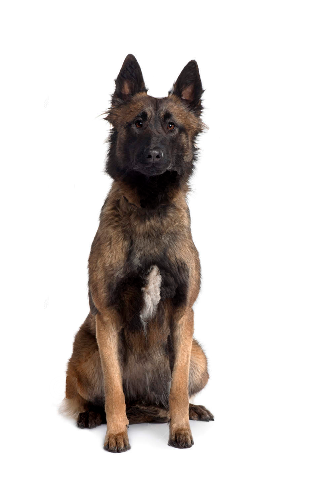
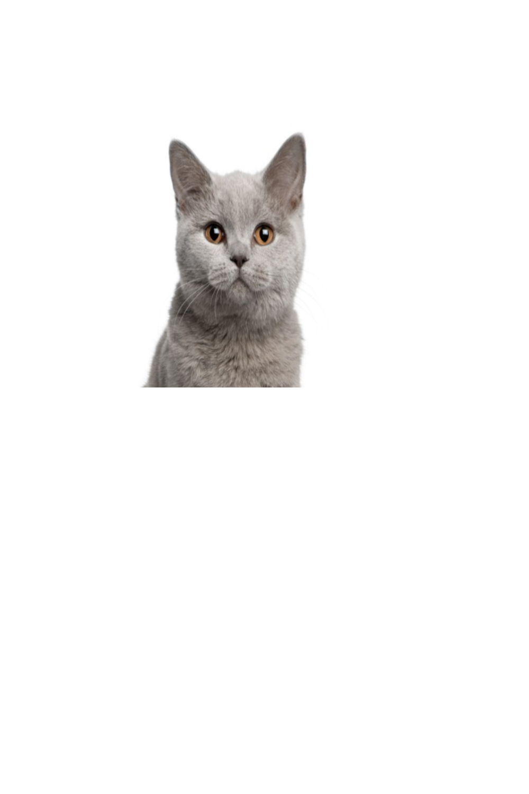
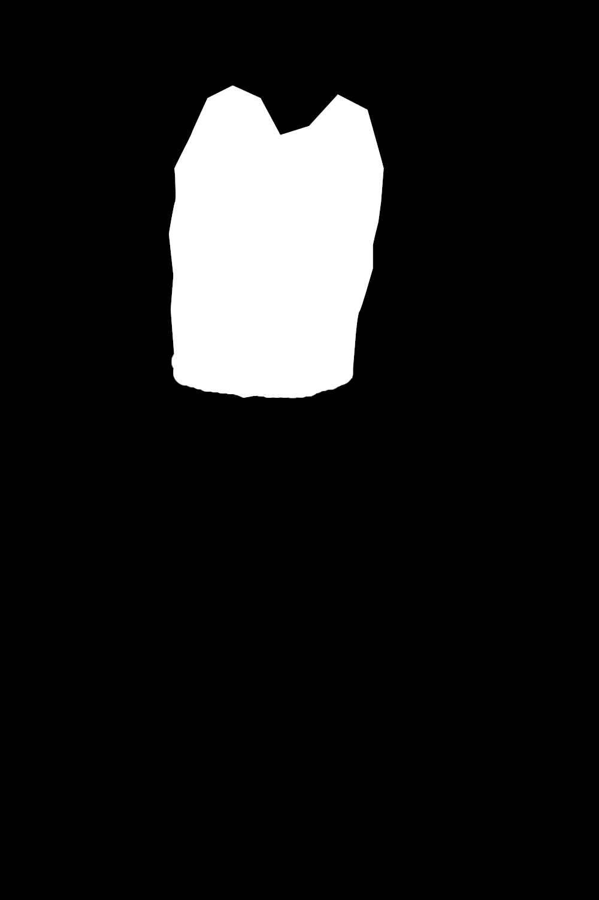

# Image Patching

The script gives the basic implementation of the Image Patching problem:

| Source Image | Patch Image | Mask |
|:-------------------------:|:-------------------------:|:-------------------------:|
|  |  |  |

The endgoal is to copy the regions from patch image into source according to the mask.
For the given sample the script generates the result

| Result Image | 
|:-------------------------:|
|  |
