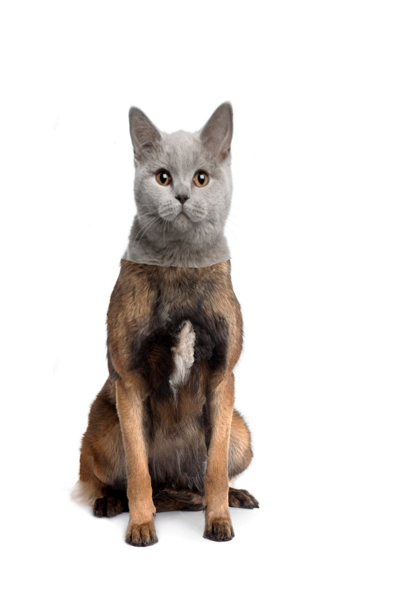

# Image Patching

## Brief
The script gives a draft solution to the Image Patching problem

## Problem Formulation
The source data of the algorithm are three images
* first source `u1`
* second source `u2`
* binary mask `m`

The problem is to find a new image `v` which looks like `u1` at regions where the mask `m` is zero, and looks like `u2` at the rest regions. 

## Solution
The main idea of the algorithm is to reformulate the original problem as an optimization problem

where `λ` is a parameters of the algorithm, and the vector field `g`

is constructed from the gradients of the source images `∇u1` and `∇u2`.

The solution to the optimization problem is a solution of the Euler-Lagrange PDE

The last one is solved with the help of Fourier transform.

# Example
There are three inputs

| Source Image | Patch Image | Mask |
|:---:|:---:|:---:|
|  |  |  |

and the result of the algorithms campated to the usual copy by the mask

| Result of optimization | Simple copy | 
|:---:|:---:|
|  | 
